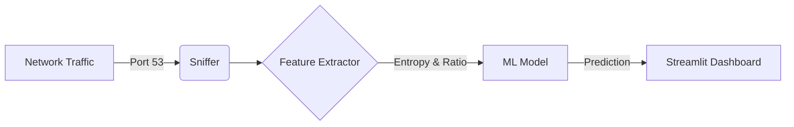

# 🛡️ DNS Guard: Real-Time DNS Tunneling Detection Engine

  

DNS Guard is a lightweight, real-time intrusion detection system (IDS) specifically designed to detect **DNS Tunneling** attacks. Unlike traditional firewalls that overlook DNS traffic, DNS Guard inspects the *entropy* and *lexical structure* of DNS queries to identify Command & Control (C2) beacons and data exfiltration attempts.

> **Why this matters:** Malicious actors often use DNS tunneling (e.g., via tools like `dnscat2`) to bypass firewalls because port 53 (DNS) is almost always left open.
---

## Architecture

The system operates in three stages:
1.  **Sniffer:** Captures UDP packets on Port 53 using `scapy`.
2.  **Feature Extractor:** Analyzes high-entropy domains and subdomains in real-time.
3.  **Inference Engine:** Uses a trained **Random Forest** classifier to flag traffic as `Benign` or `Malicious`.



---

## Getting Started

### Option 1: Run with Docker (Recommended for Testing)
The easiest way to view the UI and test the model logic.
*Note: Due to Docker network isolation, this mode can only sniff traffic generated inside the container.*

```bash
docker build -t dns-guard .
docker run -p 8501:8501 dns-guard
```
Access the dashboard at `http://localhost:8501`.

### Option 2: Run Locally (For Real Traffic Inspection)
To sniff your actual WiFi/Ethernet traffic, run directly on the host machine.

1.  **Install Dependencies:**
    ```bash
    pip install -r requirements.txt
    ```
2.  **Run the Detector:**
    ```bash
    sudo python -m streamlit run app/dashboard.py
    ```
3.  **Configure Interface:**
    In the dashboard sidebar, enter your active network interface (e.g., `en0` on macOS).

---

## Simulation & Testing

To test the detection engine without real malware:

1.  **Start the Dashboard** (Live Capture enabled).
2.  **Simulate Benign Traffic:**
    ```bash
    dig google.com
    ```
    *Result: Should be marked as SAFE.*

3.  **Simulate Tunneling Attack (High Entropy):**
    ```bash
    dig 43A5B.56F0D.12AC3.tunnel.attacker.com
    ```
    *Result: Should be marked as MALICIOUS (High probability).*

---

## Model Details

The model works by extracting the following features from every query:
*   **Shannon Entropy:** Measures potential encryption/encoding.
*   **Subdomain Count:** Tunneling requests often have deep nesting.
*   **Numerical Ratio:** Malicious payloads have higher digit density.
*   **Longest Label:** Measures the size of the longest subdomain part.

## Demo


