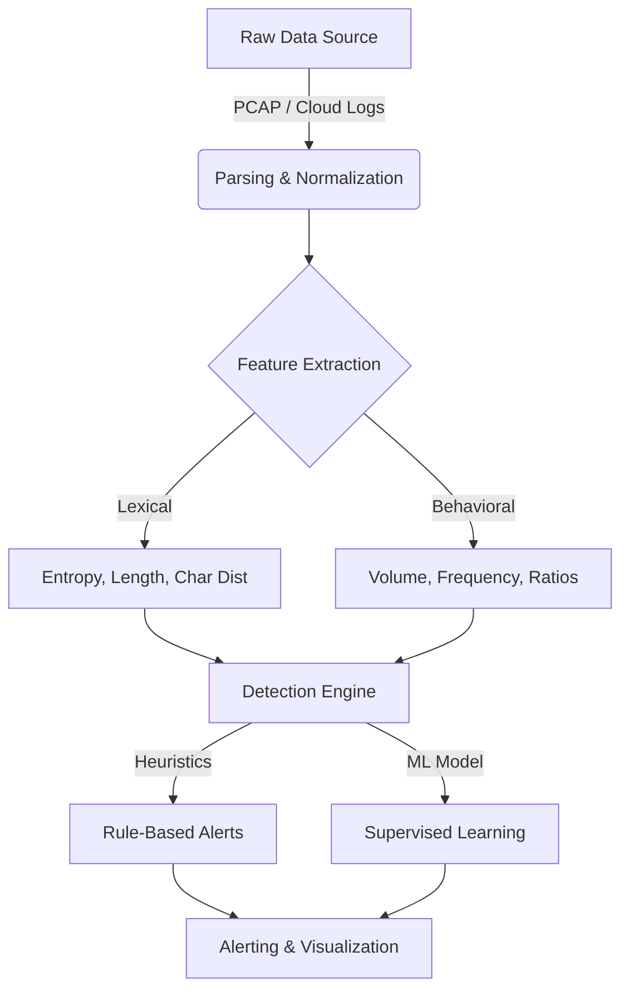

# Building a Production-Grade DNS Tunneling Detection Engine
## A Comprehensive Guide for Cybersecurity Engineers

This guide outlines the journey to build an ML-Based DNS Tunneling Detection Engine (Project A) and verify it with Cloud-Scale Logs (Project B). It is designed for someone who wants to code the solution themselves but needs a clear technical roadmap, code snippets for critical components, and architectural guidance.

---

## 🧭 Project Architecture



---

## 🛠 Prerequisites & Tools

Before writing code, ensure you have the following environment set up.

### 1. Technology Stack
*   **Language**: Python 3.9+ (Standard for ML & Security)
*   **Data Analysis**: `pandas`, `numpy`
*   **Packet Parsing**: `scapy` (for Python-centric parsing) or `zeek` (industry standard)
*   **Machine Learning**: `scikit-learn`, `xgboost`
*   **Visualization**: `matplotlib`, `seaborn`

### 2. Recommended Directory Structure
Create this structure to keep your project organized:
```bash
dns-detection-engine/
├── data/
│   ├── raw_pcaps/       # Store downloaded PCAPs here
│   ├── processed/       # CSVs/JSONs after parsing
│   └── models/          # Saved ML models (.pkl)
├── notebooks/           # Jupyter notebooks for experimentation
├── src/
│   ├── ingestion.py     # Scripts to parse PCAP/Logs
│   ├── features.py      # Feature engineering logic
│   ├── detection.py     # Main detection logic
│   └── utils.py         # Helper functions
└── requirements.txt
```

---

## 🧠 Phase 1: Data Acquisition & Parsing
**Goal**: Convert raw network traffic (PCAPs) into a structured format (CSV/DataFrame).

### 1.1 Get Data
Start with the **DNS-Tunnel-Datasets** from GitHub (e.g., from `CIRA-CIC` or `unit42`). You need both **benign** background traffic and **malicious** tunneling traffic.

### 1.2 Parsing PCAPs with Python (Scapy)
While `Zeek` is powerful, `Scapy` is easier to start with in pure Python.

**File:** `src/ingestion.py`
```python
from scapy.all import rdpcap, DNS, IP, UDP, DNSQR
import pandas as pd

def parse_pcap_to_df(pcap_path):
    # WARNING: Loading large PCAPs into memory with scapy is slow.
    # For production/large files, use 'tshark -T fields ...' or Zeek.
    try:
        packets = rdpcap(pcap_path)
    except FileNotFoundError:
        print(f"File not found: {pcap_path}")
        return pd.DataFrame()

    data = []

    for pkt in packets:
        if pkt.haslayer(DNS) and pkt.haslayer(DNSQR):
            try:
                # Extract basic query info
                # qname is bytes, decode to string
                query_bytes = pkt[DNSQR].qname
                query = query_bytes.decode('utf-8').rstrip('.')
                qtype = pkt[DNSQR].qtype
                
                # Basic metadata
                src_ip = pkt[IP].src if pkt.haslayer(IP) else None
                timestamp = float(pkt.time)
                
                data.append({
                    'timestamp': timestamp,
                    'src_ip': src_ip,
                    'query': query,
                    'qtype': qtype,
                    'size': len(pkt)
                })
            except Exception as e:
                # Skip malformed packets
                continue
            
    return pd.DataFrame(data)

# Usage
# df = parse_pcap_to_df('data/raw_pcaps/tunneling_sample.pcap')
# print(df.head())
```

---

## 🔬 Phase 2: Feature Engineering (The "Secret Sauce")
This is the most critical step. Raw queries mean nothing to a computer; mathematical properties do.

**File:** `src/features.py`

### 2.1 Shannon Entropy
Tunneling often uses high-entropy random characters (e.g., `dnscat2`).
```python
import math
from collections import Counter

def calculate_entropy(text):
    if not text:
        return 0
    entropy = 0
    total_len = len(text)
    for count in Counter(text).values():
        p = count / total_len
        entropy -= p * math.log2(p)
    return entropy
```

### 2.2 Domain Structure Features
Extract specific structural attributes helpful for detection.
```python
def extract_features(df):
    if df.empty:
        return df
        
    # 1. Query Length
    df['query_length'] = df['query'].apply(len)
    
    # 2. Entropy of the full query
    df['entropy'] = df['query'].apply(calculate_entropy)
    
    # 3. Number of subdomains (dots)
    df['subdomain_count'] = df['query'].apply(lambda x: x.count('.'))
    
    # 4. Longest Label Length (e.g., for "verylonglabel.google.com", it's 13)
    df['max_label_len'] = df['query'].apply(lambda x: max([len(l) for l in x.split('.')]) if x else 0)
    
    # 5. Suspicious Character Ratio (Base64-like chars)
    # Tunneling often uses more numbers and mix-case than normal English domains
    df['numerical_chars'] = df['query'].apply(lambda x: sum(c.isdigit() for c in x))
    df['ratio_numerical'] = df['numerical_chars'] / df['query_length']
    
    return df
```

---

## 🧪 Phase 3: Heuristic Detection (Baseline)
Before ML, implement simple rules. This helps you understand the data and catch "noisy" tools.

**File:** `src/detection.py`
```python
def heuristic_check(row):
    # Rule 1: High Entropy + Long Query (Classic Iodine/Cobalt Strike)
    if row['entropy'] > 4.5 and row['query_length'] > 50:
        return "HIGH_CONFIDENCE_TUNNEL"
    
    # Rule 2: Excessive Numerical Content (DGA-like)
    if row['ratio_numerical'] > 0.4:
        return "SUSPICIOUS_DGA"
        
    return "BENIGN"
```

---

## 🤖 Phase 4: Machine Learning Engine
Now, train a classifier to find patterns humans might miss.

**File:** `src/model_train.py`
```python
from sklearn.model_selection import train_test_split
from sklearn.ensemble import RandomForestClassifier
from sklearn.metrics import classification_report, accuracy_score
import joblib

def train_model(features_df):
    # Prepare X (features) and y (labels)
    # Assuming your dataframe has a 'label' column (0 for benign, 1 for malicious)
    feature_cols = ['query_length', 'entropy', 'subdomain_count', 'max_label_len', 'ratio_numerical']
    
    X = features_df[feature_cols]
    y = features_df['label']
    
    # Split Data
    X_train, X_test, y_train, y_test = train_test_split(X, y, test_size=0.3, random_state=42)
    
    # Initialize & Train
    clf = RandomForestClassifier(n_estimators=100, random_state=42)
    clf.fit(X_train, y_train)
    
    # Validate
    y_pred = clf.predict(X_test)
    print("Model Performance:")
    print(classification_report(y_test, y_pred))
    
    # Save Model
    joblib.dump(clf, 'data/models/dns_tunnel_rf.pkl')
    return clf
```

---

## ☁️ Phase 5: Cloud Scale (Project B Expansion)
Adapt your engine to ingest **AWS Route53 Resolver Logs**.

1.  **Enable Logging**: In AWS Console → Route 53 → Resolver → Query Logging. Destination: S3 Bucket.
2.  **Ingest from S3**:
    Use `boto3` to pull logs and map them to your schema.

```python
import boto3
import json
import gzip

def read_route53_logs(bucket_name, key):
    s3 = boto3.client('s3')
    obj = s3.get_object(Bucket=bucket_name, Key=key)
    
    # Route53 logs are often gzipped JSON
    with gzip.open(obj['Body'], 'rt') as f:
        for line in f:
            record = json.loads(line)
            # Map AWS fields to your schema
            # AWS: query_name -> Your: query
            # AWS: srcaddr -> Your: src_ip
            yield {
                'query': record.get('query_name'),
                'src_ip': record.get('srcaddr'),
                'timestamp': record.get('query_timestamp')
            }
```

---

## 📚 Resources & Next Steps
1.  **Datasets**: Search GitHub for "DNS-Tunnel-Datasets" (CIRA-CIC-DoHBrw-2020 is a good one).
2.  **Tools to Test**:
    *   `dnscat2`: For generating your own live malicious traffic.
    *   `iodine`: Another classic tunneling tool.
3.  **Visualization**:
    *   Use `matplotlib` to plot `Entropy` vs `Query Length`. You will likely see two distinct clusters (Benign vs Malicious).

### Your First Task
1.  Create the directory structure.
2.  Download a sample PCAP (e.g. from Wireshark Sample Captures or a Dataset repo).
3.  Implement the `ingestion.py` script above and print the first 10 rows.

