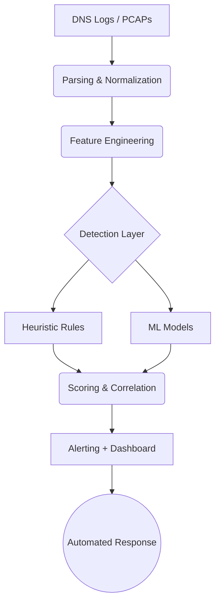

# 14-Week Roadmap: Building a Production-Grade DNS Tunneling Detection Engine

This guide provides a practical, end-to-end roadmap you could realistically follow over ~10–14 weeks to build two flagship, production-grade security projects. This roadmap is written the way a staff security engineer would plan it.

You will build:
1.  **Project A: ML-Based DNS Tunneling Detection Engine**
2.  **Project B: Cloud-Scale DNS Exfiltration Detection (AWS / GCP)**

They share infrastructure, datasets, and detection logic, mirroring how real security teams operate.

---

## 🧭 Overall Architecture (Shared Mental Model)



---

## 🧠 Phase 0: Foundations (Week 0–1)
**Goal**: Deep understanding of DNS internals. Do NOT skip this; depth here is critical.

### Key Concepts to Master
*   **DNS Internals**: Recursive vs. Authoritative resolution, TTL behavior, Label compression, EDNS0, DNS over UDP vs. TCP.
*   **Abuse Patterns**:
    *   **Tunneling**: Iodine, dnscat2, Cobalt Strike DNS beacons.
    *   **Techniques**: DGA vs. Tunneling, TXT record abuse, Fast flux.
*   **Cloud Logging**:
    *   **AWS**: Route53 Resolver Query Logs.
    *   **GCP**: Cloud DNS logging.
    *   *Note*: Understand the differences in field availability and granularity between clouds.

---

## 📦 Phase 1: Data Ingestion & Logging (Weeks 1–3)

### Project A (ML Engine): Raw DNS Traffic
*   **Data Sources**:
    *   PCAPs from Malware Traffic Analysis, CIC-IDS datasets.
    *   Your own lab-generated tunnels (using tools like `dnscat2`).
*   **Tools**:
    *   **Zeek**: Core dependency for robust parsing.
    *   **tshark**: Backup parsing option.
*   **Output Schema**: Normalize early!
    ```json
    {
      "timestamp": "...",
      "src_ip": "...",
      "query_name": "...",
      "query_type": "TXT",
      "response_code": "NOERROR",
      "ttl": 300,
      "query_length": 52
    }
    ```

### Project B (Cloud Scale): Managed DNS Logs
*   **AWS**: Enable Route53 Resolver Query Logs → Stream to **S3** (preferred) or CloudWatch.
*   **GCP**: Enable Cloud DNS logs → Log Sink → **BigQuery** / GCS.
*   **Unified Normalization**: Write a script to convert specific AWS/GCP log formats into your Unified Schema. This is a key resume highlight.

---

## 🔬 Phase 2: Feature Engineering (Weeks 3–5)
**Goal**: Transform raw logs into mathematical vectors. This is where most projects fail.

### Core Features (Both Projects)
*   **Lexical Features**:
    *   Subdomain length, Longest label length.
    *   Character distribution, Entropy per label.
    *   Base32/Base64 likelihood scores.
*   **Behavioral Features**:
    *   Query frequency per domain.
    *   Inter-arrival time variance.
    *   Ratio of NXDOMAIN responses.
    *   TXT query ratio.
*   **Structural Features**:
    *   Unique subdomains per domain.
    *   Depth of domain tree.
    *   TTL variance.

### Cloud-Specific Features (Project B)
*   Queries per **IAM role**.
*   Queries per **Workload** (EC2 instance, GKE pod).
*   Time-of-day deviation for specific services.

---

## 🧪 Phase 3: Heuristic Detection Baseline (Weeks 5–6)
**Goal**: Prove domain understanding before applying ML.

### Implementation
Create a rule engine that outputs signals:
```json
{
  "signal": "HIGH_ENTROPY_LABEL",
  "confidence": 0.72
}
```

### Example Rules
1.  **Entropy Cutoff**: Entropy > Threshold AND Long Subdomains.
2.  **Volume/TTL**: High TXT usage AND Low TTL.
3.  **Error Rate**: Excessive NXDOMAIN rate (DGA indicator).
4.  **Consistency**: Uniform query size over time (Beaconing).

*These signals become inputs for your ML model later.*

---

## 🤖 Phase 4: ML Detection Engine (Weeks 6–8)
**Goal**: Build a hybrid detection system. Big tech SOCs never rely on just one model.

### Model Strategy
1.  **Supervised Learning** (XGBoost / Random Forest):
    *   **Labels**: Benign DNS, Tunneling, DGA (separate these!).
    *   **Training**: Train on PCAP-derived data.
2.  **Unsupervised Learning** (Isolation Forest):
    *   Detect anomalies that don't fit known patterns.
    *   *Stretch*: Autoencoders.

### Validation
*   **Test Sets**: Validate on new malware families and synthetic evasion attempts.
*   **Metrics**: Focus on **Precision** (low False Positives) over Recall. Measure "Time-to-detection".

---

## 🔍 Phase 5: Explainability (Week 8–9)
**Goal**: Make the "Black Box" transparent. This is a huge differentiator.

### Implementation
Use **SHAP (SHapley Additive exPlanations)** or Feature Attribution.
For *every* alert, generate a human-readable explanation:
> "Flagged due to high entropy (0.91) and repeated TXT queries at 10s intervals."

**Deliverable**: Top 5 contributing features included in the alert payload.

---

## ☁️ Phase 6: Cloud Correlation & Scale (Weeks 9–10)
**Goal**: Contextualize DNS alerts with Cloud Identity (Project B Focus).

### Correlation Sources
*   Match DNS IP/Timestamp to **EC2 Instance IDs**.
*   Correlate with **GKE Pod Metadata**.
*   Link activity to **IAM Role Usage**.
*   *(Optional)* VPC Flow Logs.

### Detection Enhancements
*   **Peer-Group Analysis**: "Does this EC2 instance behave differently than others in the same Security Group?"
*   **Per-Workload Baselines**: distinct models for Web Servers vs. Database nodes.

---

## 🚨 Phase 7: Alerting & Automated Response (Weeks 10–11)

### Alert Pipeline
1.  **Severity Scoring**: Aggregate Heuristic + ML scores.
2.  **Deduplication**: Group related queries into a single "Incident".
3.  **Output**: Send to Slack / Email / PagerDuty.

### Automated Actions (Optional)
*   **Quarantine**: Isolate the EC2 instance.
*   **Revoke**: Disable the compromised IAM role.
*   **Block**: Add domain to a Route53 Resolver Firewall / Denylist.
*   *Critical*: Always include a **"Dry-Run"** mode.

---

## 📊 Phase 8: Visualization & UI (Weeks 11–12)

### Dashboards
*   **Top Suspicious Domains** list.
*   **Entropy Heatmaps** over time.
*   **Per-Workload DNS Behavior** (Queries/sec).
*   **Detection Confidence** trend.

### Tools
*   **Web App**: Plotly / D3.js.
*   **Cloud Native**: Grafana (ingesting from CloudWatch/Prometheus).

---

## 🧾 Phase 9: Research-Grade Writeup (Week 13)
Your README is your sales pitch.

### Content
*   **Threat Model**: What are you catching?
*   **Dataset Sources**: Where did training data come from?
*   **Feature Rationale**: Why Base64 features?
*   **Detection Logic**: How do the models work?
*   **False Positive Analysis**: When does it fail?
*   **Scalability**: How does it handle 10k QPS?
*   **Evasion**: How could an attacker bypass this?

---

## 🧠 Phase 10: Interview & Resume Positioning (Week 14)

### Resume Line Example
> "Built a cloud-scale DNS exfiltration detection system ingesting AWS Route53 and GCP DNS logs, combining heuristic and ML-based detection to identify covert data exfiltration with explainable alerts and automated remediation."

### Why This Roadmap Works
You demonstrate:
*   **Protocol Mastery** (DNS internals).
*   **Detection Engineering** (Feature selection).
*   **Applied ML** (Not just "import sklearn", but operational metrics).
*   **Cloud Realism** (IAM, CloudWatch, Scaling).
*   **Operational Thinking** (Alert fatigue, dashboards).

This is exactly the intersection of **SWE + Security + ML** that top tech companies look for.

---

## 💻 Reference Implementation Code

Use these snippets to build your project. Type them out to understand the logic!

### 1. Packet Ingestion (`src/ingestion.py`)
This script uses Scapy to read PCAP files and extract DNS query data.

```python
from scapy.all import rdpcap, DNS, IP, UDP, DNSQR
import pandas as pd

def parse_pcap_to_df(pcap_path):
    try:
        packets = rdpcap(pcap_path)
    except FileNotFoundError:
        print(f"File not found: {pcap_path}")
        return pd.DataFrame()

    data = []

    for pkt in packets:
        if pkt.haslayer(DNS) and pkt.haslayer(DNSQR):
            try:
                # Extract query info
                query_bytes = pkt[DNSQR].qname
                # Decode bytes to string and remove trailing dot
                query = query_bytes.decode('utf-8').rstrip('.')
                qtype = pkt[DNSQR].qtype
                
                # Get Source IP (tunneling source)
                src_ip = pkt[IP].src if pkt.haslayer(IP) else None
                timestamp = float(pkt.time)
                
                data.append({
                    'timestamp': timestamp,
                    'src_ip': src_ip,
                    'query': query,
                    'qtype': qtype,
                    'size': len(pkt)
                })
            except Exception as e:
                continue
            
    return pd.DataFrame(data)
```

### 2. Feature Engineering (`src/features.py`)
This extracts mathematical properties from the domain names.

```python
import math
from collections import Counter

def calculate_entropy(text):
    if not text:
        return 0.0
    entropy = 0.0
    total_len = len(text)
    for count in Counter(text).values():
        p = count / total_len
        entropy -= p * math.log2(p)
    return entropy

def extract_features(df):
    if df.empty:
        return df
        
    # 1. Query Length
    df['query_length'] = df['query'].apply(len)
    
    # 2. Entropy (Randomness)
    df['entropy'] = df['query'].apply(calculate_entropy)
    
    # 3. Subdomain Count (dots)
    df['subdomain_count'] = df['query'].apply(lambda x: x.count('.'))
    
    # 4. Longest Label Length
    # e.g., "verylonglabel.google.com" -> 13
    df['max_label_len'] = df['query'].apply(lambda x: max([len(l) for l in x.split('.')]) if x else 0)
    
    # 5. Numerical Character Ratio
    # Tunneled data often has many numbers (Base32/64)
    df['numerical_chars'] = df['query'].apply(lambda x: sum(c.isdigit() for c in x))
    df['ratio_numerical'] = df['numerical_chars'] / df['query_length']
    
    return df
```

### 3. Heuristic Detection (`src/detection.py`)
Simple rules to catch obvious tunneling before using ML.

```python
def heuristic_check(row):
    """
    Returns a comprehensive signal based on simple thresholds.
    These thresholds might need tuning based on your specific traffic.
    """
    # Rule 1: High Entropy + Long Query (Classic Iodine/Cobalt Strike)
    if row['entropy'] > 4.5 and row['query_length'] > 50:
        return "HIGH_CONFIDENCE_TUNNEL"
    
    # Rule 2: Excessive Numerical Content (DGA-like)
    if row['ratio_numerical'] > 0.4:
        return "SUSPICIOUS_DGA"
    
    # Rule 3: Deeply nested subdomains
    if row['subdomain_count'] > 5:
        return "SUSPICIOUS_DEPTH"
        
    return "BENIGN"
```
